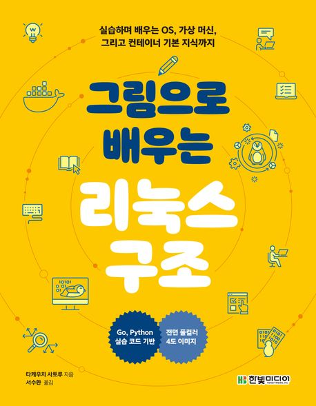

# 그림으로 배우는 리눅스 구조 스터디

## 📚 스터디 소개

데브옵스 실무에 필요한 리눅스 운영체제의 핵심 구조를 함께 공부하는 스터디입니다.

**스터디 일정**
- 시간: 매주 수요일 밤 10시
- 형식: 온라인/오프라인 (추후 결정)

## 📖 교재

  

**그림으로 배우는 리눅스 구조**

이 책은 리눅스 운영체제의 내부 구조를 실습과 그림을 통해 이해하기 쉽게 설명합니다. 프로세스, 메모리 관리, 파일 시스템, 가상 머신, 컨테이너 등 데브옵스 엔지니어가 반드시 알아야 할 핵심 개념들을 다룹니다.

## 🎯 학습 목표

- 리눅스 커널의 동작 원리 이해
- 프로세스와 메모리 관리 메커니즘 학습
- 파일 시스템과 I/O 구조 파악
- 가상화와 컨테이너 기술의 기초 이해
- 실무에 적용 가능한 시스템 운영 지식 습득

## 📝 진행 방식

- 매주 정해진 분량을 각자 학습
- 스터디 시간에 학습 내용 공유 및 토론
- 궁금한 점과 어려운 부분 함께 해결

## 👥 참여 방법

이 저장소를 clone하여 자기이름의 브랜치를 만들고 각자의 학습 내용과 실습 결과를 정리해주세요.